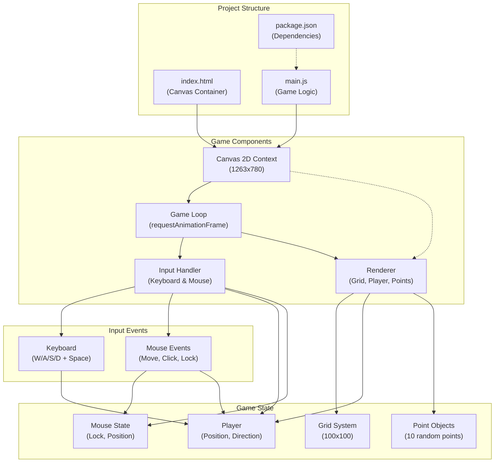

# Project Architecture

## System Overview

## Components

### Project Structure
- **index.html** - HTML entry point with canvas container (1263x780)
- **main.js** - Core game logic and rendering engine
- **package.json** - Build configuration using Vite with Prettier for formatting

### Game Components
- **Canvas 2D Context** - Renders all game visuals
- **Input Handler** - Processes keyboard and mouse events
- **Renderer** - Draws grid, player, and point objects each frame
- **Game Loop** - Uses `requestAnimationFrame` for smooth 60+ FPS updates

### Game State
- **Player** - Position (playerX, playerY) and direction (playerDir)
- **Grid System** - 100x100 procedurally generated grid with walls
- **Point Objects** - 10 randomly placed point objects in world space
- **Mouse State** - Tracks lock status and position

### Input Events
- **Keyboard** - WASD for movement, Space to toggle mouse lock
- **Mouse Events** - Move for camera control, click to lock pointer, context menu disabled
